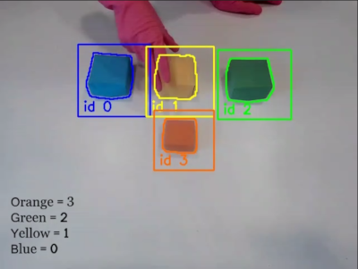

# Anchor Tracking

Tracking system using the anchoring framework.

Matching function was tested with Naive Bayes, KNN, Logistic Regression and Decision Tree.

Two different approaches were compared:

- Approach 1: Frame-wise Classification (anchor everything all the time)
- Approach 2: Only anchor stationary objects while tracking moving ones (with help of Kalman Filter)

Colors were used as ground truth for training.

